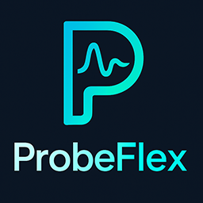

<p align="center">
  
</p>

---

## What is ProbeFlex?

**ProbeFlex** is a comprehensive open-source toolkit—built with **Python 3.13 + Django 5.2 + Django REST Framework**—for designing, running, and testing API endpoints at any scale.  
Think of it as an *"API testing workbench in your browser"*:

- **Test API endpoints in real-time** and view structured responses  
- **Organize your API requests** into projects and collections  
- **Track request history** with complete request data and responses  
- **Team collaboration** with shared project access permissions
- **Authentication support** for various auth methods (Basic, Bearer, API Key)

> Whether you're developing APIs, testing third-party services, or debugging endpoints, ProbeFlex provides a clean, intuitive interface for all your API testing needs.

---

## Quick Start

```bash
# 1 Clone
git clone https://github.com/ProbeFlex/ProbeFlex.git
cd ProbeFlex

# 2 Create a virtual environment
python -m venv .venv

# On Windows:
.venv\Scripts\activate

# On Unix or MacOS:
source .venv/bin/activate

# 3 Install dependencies
pip install -r requirements.txt

# 4 Run migrations
python manage.py makemigrations
python manage.py migrate

# 5 Create a superuser
python manage.py createsuperuser

# 6 Run the application
python manage.py runserver
```

Open **`http://127.0.0.1:8000/`** in your browser. If you're not logged in, you'll be redirected to the login page.

---

## Features

### User Management
- **User authentication** with login, registration, and remember me functionality
- **Team management** for collaborative work on projects

### API Testing Interface
- **HTTP Methods:** Support for GET, POST, PUT, PATCH, DELETE, HEAD, and OPTIONS
- **Request Configuration:**
  - URL parameters
  - Authentication (Basic, Bearer Token, API Key)
  - Headers customization
  - Request body (JSON, Form Data, Raw)
  - Response visualization with formatted JSON

### Project Organization
- **Projects:** Create and manage multiple projects
- **Collections:** Organize related API requests within projects
- **Request History:** Track all request executions with complete request and response data
- **Access Control:** Control which teams have access to specific projects

---

## Project Structure

```
ProbeFlex/
├── probe_app/               # Main application
│   ├── models.py            # Data models for projects, collections, requests
│   ├── views.py             # View controllers
│   ├── forms.py             # Form definitions
│   └── admin.py             # Admin interface configuration
├── templates/               # HTML templates
│   ├── registration/        # Authentication templates
│   ├── projects/            # Project management templates
│   ├── collections/         # Collection templates
│   ├── requests/            # API request templates
│   └── teams/               # Team management templates
├── static/                  # Static assets
│   └── img/                 # Images and icons
├── probe_flex/              # Project settings
│   ├── settings.py          # Django settings
│   └── urls.py              # URL configuration
└── requirements.txt         # Project dependencies
```

---

## Tech Stack

* **Backend Framework:** Django 5.2
* **API Framework:** Django REST Framework
* **Frontend:** Bootstrap 5, JavaScript
* **Database:** SQLite (default), PostgreSQL (supported)
* **Form Processing:** django-crispy-forms with Bootstrap 5 theme
* **Authentication:** django-allauth

---

## Future Enhancements

- **Environment Variables:** Support for environment-specific variables
- **Request Scheduling:** Set up recurring API tests with Celery
- **Monitoring Dashboard:** Track API performance and uptime
- **Test Assertions:** Add validation rules for response content
- **Collection Export/Import:** Share and import Postman collections

---

## 📜 License

ProbeFlex is released under the **MIT License** - see `LICENSE` file.

---

> **Test, probe, flex.**
> May your APIs always return **200 OK**.

---

## Donation and Support 
If you appreciate our work and wish to support the continuation and expansion of our project, please consider making a donation. Your contributions will enable us to keep improving and add new features. You can donate to the following cryptocurrency addresses. Thank you for your support!

* **USDT**: 0xa5a87a939bfcd492f056c26e4febe102ea599b5b
* **BUSD**: 0xa5a87a939bfcd492f056c26e4febe102ea599b5b
* **BTC**: 184FDZ1qV2KFzEaNqMefw8UssG8Z57FA6F
* **ETH**: 0xa5a87a939bfcd492f056c26e4febe102ea599b5b
* **SOL**: Gt3bDczPcJvfBeg9TTBrBJGSHLJVkvnSSTov8W3QMpQf
